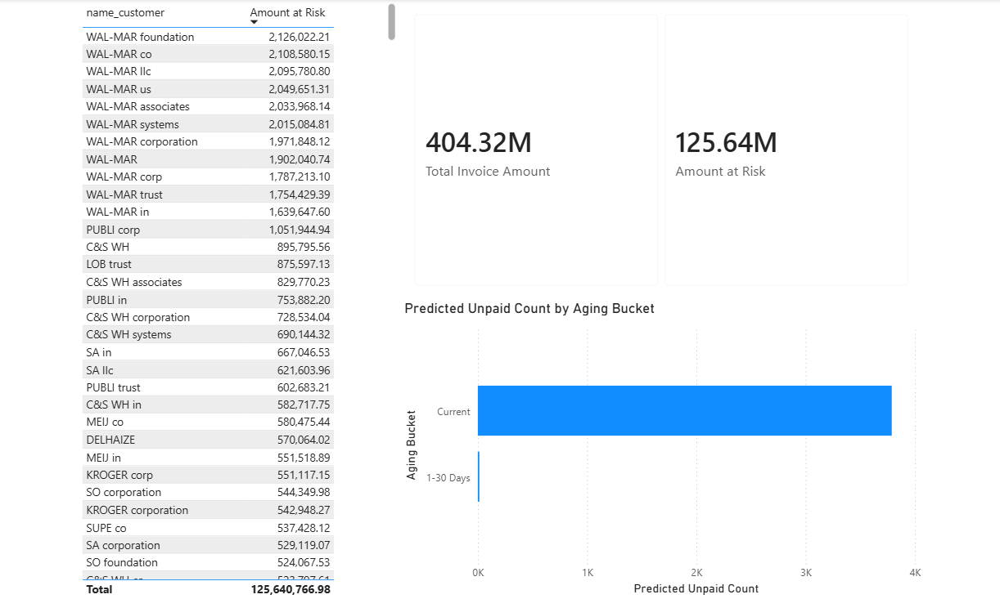

# Invoice Payment Status Prediction using Logistic Regression

🔗 **Live Demo:** [Try the app here](https://invoice-payment-prediction.streamlit.app/)

## Project Overview

This project uses the **Customer Invoices Dataset from Kaggle** to predict whether an invoice is paid or still unpaid based on available invoice-related features.

The business problem being solved is:

> Can we predict whether an invoice is paid or unpaid so that collections teams can prioritize invoices that may still require follow-up?

This project applies a Logistic Regression classification model with preprocessing, pipeline handling, hyperparameter tuning, and threshold optimization. The main goal is not only to build a model with good test performance, but to evaluate the model based on actual business impact in an Accounts Receivable / Order-to-Cash workflow.

---

## Business Context

In Accounts Receivable and collections operations, missing unpaid invoices can directly affect cash flow, follow-up prioritization, and collection performance.

A model like this supports collectors by identifying invoices more likely to remain unpaid, allowing teams to focus attention on invoices that require action.

The key business trade-off is:

- **False Negative (FN):** The model predicts the invoice as paid, but it is actually unpaid — a missed collection opportunity.
- **False Positive (FP):** The model predicts the invoice as unpaid, but it is actually paid — creates additional manual review work.

For this project, **False Negatives are more costly** because missed unpaid invoices may not be followed up, directly impacting cash flow.

---

## Dataset

- **Source:** Customer Invoices Dataset from Kaggle
- **Problem Type:** Binary Classification
- **Target Variable:** `isOpen` (1 = unpaid, 0 = paid)

---

## Features Used

The model uses invoice and customer-related features:

| Feature | Type |
|---|---|
| `business_code` | Categorical |
| `buisness_year` | Numerical |
| `invoice_currency` | Categorical |
| `document type` | Categorical |
| `total_open_amount` | Numerical |
| `cust_payment_terms` | Categorical |
| `arrears` | Numerical (engineered) |

---

## Feature Engineering

### arrears
`arrears` was engineered from AR domain knowledge as:

```python
arrears = posting_date - due_in_date
```

This captures how many days before or after the due date an invoice was posted — a meaningful signal for predicting payment behavior.

### Data Leakage — clear_date Removed
The column `clear_date` was identified and removed before modeling. This column is only populated when an invoice is paid, meaning it directly encodes the target variable. Including it would cause data leakage and produce artificially inflated model performance.

This was identified independently using Accounts Receivable domain knowledge before any model was built.

---

## Data Preprocessing

Preprocessing was handled inside a Scikit-learn pipeline to prevent data leakage. All transformations were fit only on training data.

**Numerical features:**
- `SimpleImputer(strategy='median')` — handles missing values
- `RobustScaler()` — scales features while handling outliers, selected after observing a large gap between mean and median in `total_open_amount`

**Categorical features:**
- `SimpleImputer(strategy='constant', fill_value='missing')` — preserves missingness as a learnable signal
- `OneHotEncoder(handle_unknown='ignore')` — encodes categorical variables

Both branches were combined using `ColumnTransformer` and wrapped in a full `Pipeline` with the model.

---

## Train-Test Split

```python
train_test_split(X, y, test_size=0.25, random_state=42, stratify=y)
```

- 75% training, 25% testing
- Stratified to preserve class distribution across both sets

---

## Model

```python
LogisticRegression(max_iter=1000, class_weight='balanced')
```

Logistic Regression was selected as a strong baseline for binary classification on structured tabular data. `class_weight='balanced'` was added to handle class imbalance in the dataset — without it, the model defaulted to predicting the majority class and produced recall of 0.14.

Probability outputs allow threshold tuning, which is critical for business-driven decision-making.

---

## Hyperparameter Tuning

Tuning was performed using `GridSearchCV` with `scoring='recall'` — recall was chosen because minimizing False Negatives is the priority.

```python
param_grid = {'model__C': [0.001, 0.01, 0.1, 1, 10]}
```

**Best parameter found:**

```python
C = 0.01
```

Lower C applies stronger regularization, producing a more generalized model less likely to overfit.

---

## Threshold Optimization

Instead of relying on the default 0.50 threshold, multiple thresholds were tested to find the best business trade-off.

| Threshold | TN | FP | FN | TP |
|---|---|---|---|---|
| 0.76 | 8699 | 1301 | 0 | 2500 |
| 0.77 | 8699 | 1301 | 1 | 2499 |
| 0.78 | 8700 | 1300 | 1 | 2499 |
| 0.79 | 8700 | 1300 | 1 | 2499 |
| 0.80 | 8704 | 1296 | 3 | 2497 |
| 0.81 | 8740 | 1260 | 48 | 2452 |
| 0.82 | 8756 | 1244 | 64 | 2436 |

**Selected threshold: 0.76**

At 0.76, the model produced **0 False Negatives** — no unpaid invoices were missed. The 1301 False Positives are routed to a manual review queue for collectors.

This threshold was chosen because missing an unpaid invoice is more costly than the operational overhead of manual review. In an AR workflow, cash flow protection takes priority over minimizing collector workload.

---

## Collections Workflow Interpretation

| Prediction | Action |
|---|---|
| True Positive (TP) | Flag for collection follow-up |
| False Positive (FP) | Route to manual review queue |
| True Negative (TN) | No action required |
| False Negative (FN) | Missed — no follow-up triggered |

At threshold 0.76, FN = 0. All unpaid invoices in the test set were correctly flagged.

---

## Key Learnings

- Building end-to-end ML pipelines with Scikit-learn
- Identifying and removing data leakage using domain knowledge
- Handling class imbalance with `class_weight='balanced'`
- Selecting scalers based on data distribution (`RobustScaler` vs `StandardScaler`)
- Hyperparameter tuning with `GridSearchCV`
- Threshold optimization driven by business cost, not accuracy
- Translating model output into an AR collections workflow

---

## Future Improvements

- Engineer aging-related features (days outstanding, payment history)
- Test Random Forest and Gradient Boosting models
- Add Precision, Recall, F1, and ROC-AUC evaluation
- Use actual invoice values for cost-weighted threshold optimization

---

Deployment

This project is deployed as an interactive Streamlit web app, allowing users to input invoice details and receive a real-time payment status prediction at the optimized 0.76 threshold.

Live app: https://invoice-payment-prediction.streamlit.app/

---

## Tech Stack

- Python, Pandas, NumPy
- Scikit-learn: LogisticRegression, Pipeline, ColumnTransformer, OneHotEncoder, RobustScaler, GridSearchCV
- Power BI
- Streamlit (deployment)
- joblib (model persistence)

---

## Dashboard


